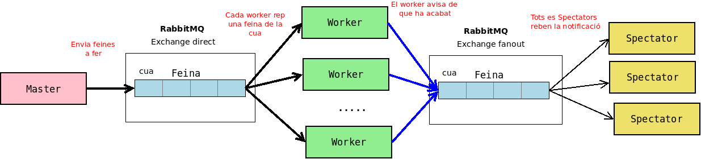

# Repartir tasques entre clients

Es tracta d'una prova senzilla de crear una cua de missatges entre un emissor **Master** (productor) i uns quants receptors **Worker** (consumers).

En aquest exemple els missatges es reparteixen entre els clients de forma ordenada (no agafen nous missatges a menys que hagin "acabat" els vells).

En l'exemple faig servir l'**exchange** per defecte. Normalment se n'ha de crear un (que pot ser direct, topic i fanout) i assignar-li la cua a dins

- **Direct**: Entrega de missatges directa
- **Fanout**: El missatge s'envia a tots els subscrits. Es fa servir pel patró emissor-subscriptors
- **Topic**: El missatge s'envia segons condicions definides en el nom.

> No faig cap de les coses que s'han de fer: captura d'excepcions, reconnexions, etc... Només és una prova.

PROPERAMENT: Emissor / Subscriptors

## Requeriments

Per poder provar els programes cal tenir RabbitMQ instal·lat i en marxa (el més fàcil és fer servir docker)

    docker run -d --hostname my-rabbit --name some-rabbit rabbitmq:3

## Exemple

No importa en l'ordre en que s'engeguen els programes però jo sempre començo pel master (que envia uns quants missatges als receptors).

- Si no hi ha cap receptor es queden en la cua de RabbitMQ fins que algú els demana
- Si hi ha algun client en marxa el client n'agafa un

L'inicio normalment:

    $ dotnet run
    [*] Enviant: Construir un avió de paper....
    [*] Enviant: Pintar el paper........
    [*] Enviant: Agafar el barret......
    [*] Enviant: Mirar la hora....
    [*] Enviant: Prendre la Bastilla..................
    [*] Enviant: Menjar ........
    [*] Enviant: Mirar si plou..........

Després només cal iniciar diferentes instàncies dels Workers. Aniran rebent els missatges com bons germans

Client 1:

    $ dotnet run
    [*] Esperant feina.
    Prem [enter] per sortir.
    [x] Fent la tasca: Construir un avió de paper....
    [x] Tasca acabada
    [x] Fent la tasca: Agafar el barret......
    [x] Tasca acabada
    [x] Fent la tasca: Mirar la hora....
    [x] Tasca acabada
    [x] Fent la tasca: Menjar ........
    [x] Tasca acabada
    [x] Fent la tasca: Mirar si plou..........
    [x] Tasca acabada

Client 2:

    $ dotnet run
    [*] Esperant feina.
    Prem [enter] per sortir.
    [x] Fent la tasca: Pintar el paper........
    [x] Tasca acabada
    [x] Fent la tasca: Prendre la Bastilla..................
    [x] Tasca acabada

Els clients continuen a l'espera fins que es prem la tecla 'enter' de manera que es poden tornar a fer enviaments mentre estan en marxa.
