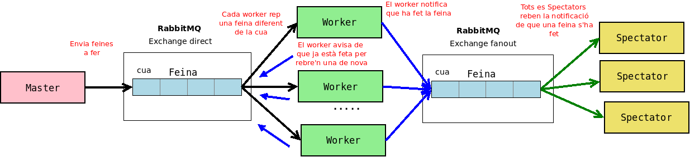

# Repartir tasques entre clients

Es tracta d'una prova senzilla de crear una cua de missatges entre un emissor **Master** (productor) i uns quants receptors **Worker** (consumers). Quan un dels **Workers** acaba una feina envia un missatge broadcast a tots els **Spectators**

En aquest exemple els missatges es reparteixen entre els clients de forma ordenada (no agafen nous missatges a menys que hagin "acabat" els vells).

En l'exemple faig servir l'**exchange** per defecte per enviar missatges directes i només en creo un de personalitzat pel missatge de Broadcast.

Normalment se n'ha de crear un (que pot ser direct, topic i fanout) i assignar-li la cua a dins

- **Direct**: Entrega de missatges directa
- **Fanout**: El missatge s'envia a tots els subscrits. Es fa servir pel patró emissor-subscriptors
- **Topic**: El missatge s'envia segons condicions definides en el nom.

> No faig gaires de les coses que s'han de fer: captura d'excepcions, reconnexions, etc... Només és una prova.

> Sembla que hi ha un paquet EasyNetQ que simplifica el funcionament amb RabbitMQ des de NET.

## Requeriments

Per poder provar els programes cal tenir RabbitMQ instal·lat i en marxa (el més fàcil és fer servir docker)

    docker run -d --hostname my-rabbit --name some-rabbit rabbitmq:3

## Funcionament

No importa en l'ordre en que s'engeguen els programes quan es fa referència al Master i els Workers. En canvi els Spectators només rebran els missatges que s'emetin quan ells estan en marxa (els que s'emetin abans d'iniciar-los es perden) o sigui que el millor és engegar-los abans que els Workers.

Per exemple:

- Si es comença pel master envia els missatges immediatament i com que no hi ha cap repector queden emmagatzemats a la cua fins que algun client els demana.
- Si es comença pels Workers es queden a l'espera de que un Master els envii alguna tasca

> Per fer que sembli que els Workers treballen Els missatges tarden en ser processats tants segons com punts tinguin (es tracta de l'exemple de la web de RabbitMQ)

### Exemple

Inicio normalment el Master i comença a enviar les tasques a la cua:

    $ dotnet run
    [*] Enviant: Construir un avió de paper....
    [*] Enviant: Pintar el paper........
    [*] Enviant: Agafar el barret......
    [*] Enviant: Mirar la hora....
    [*] Enviant: Prendre la Bastilla..................
    [*] Enviant: Menjar ........
    [*] Enviant: Mirar si plou..........

Després inicio els Spectators (se'n poden iniciar tants com calgui) que quedaran a l'espera:

    $ dotnet run
    [*] Esperant informes.
    Prem [enter] per sortir.

Al iniciar les instàncies dels Workers aniran rebent les tasques a fer de la cua. Quan acabin una tasca fan tres coses:

- La marquen com acabada
- Notifiquen els espectadors
- Si n'hi ha n'agafen una altra i si no n'hi ha queden a l'espera

Client 1:

    $ dotnet run
    [*] Esperant feina.
    Prem [enter] per sortir.
    [x] Fent la tasca: Construir un avió de paper....
    [x] Tasca acabada
    [x] Fent la tasca: Agafar el barret......
    [x] Tasca acabada
    [x] Fent la tasca: Mirar la hora....
    [x] Tasca acabada
    [x] Fent la tasca: Menjar ........
    [x] Tasca acabada
    [x] Fent la tasca: Mirar si plou..........
    [x] Tasca acabada

Client 2:

    $ dotnet run
    [*] Esperant feina.
    Prem [enter] per sortir.
    [x] Fent la tasca: Pintar el paper........
    [x] Tasca acabada
    [x] Fent la tasca: Prendre la Bastilla..................
    [x] Tasca acabada

Els clients continuen a l'espera fins que es prem la tecla 'enter' de manera que es poden tornar a fer enviaments mentre estan en marxa.

Tots els "espectadors" reben les notificacions de tots els clients quan han acabat una feina:

    $dotnet run
    [] Feina Acabada: Acabat: Construir un avió de paper....
    [] Feina Acabada: Acabat: Agafar el barret......
    [] Feina Acabada: Acabat: Pintar el paper........
    [] Feina Acabada: Acabat: Mirar la hora....
    [] Feina Acabada: Acabat: Menjar ........
    [] Feina Acabada: Acabat: Prendre la Bastilla..................
    [] Feina Acabada: Acabat: Menjar un altre cop ..
    [] Feina Acabada: Acabat: Mirar si plou..........
    [] Feina Acabada: Acabat: Llegir alguna cosa ...
    [] Feina Acabada: Acabat: Esperar l'autocar ....................

Una captura del programa en execució (sense espectadors):

I un exemple de la sortida d'un dels espectadors:

